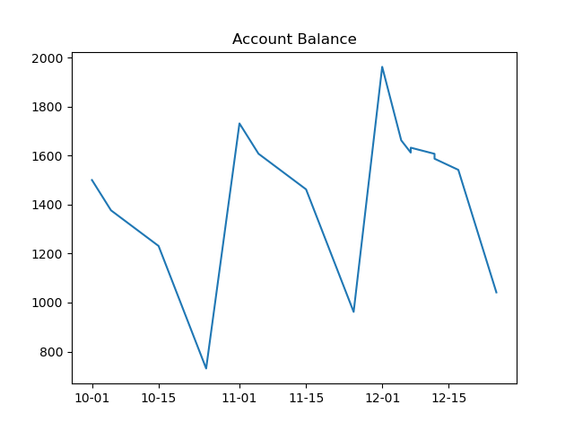
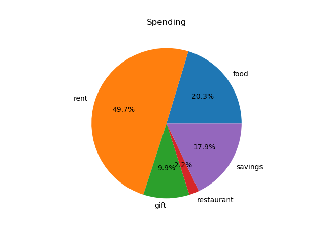

# python-budget

Reads in a .csv file and then plots the account balance and spending chart.
The example .csv file can be found:

    ./statement/statement.csv

Transaction values in statement.csv are stored in cents rather than dollars.

## Sample Output

### Improvement Ideas
- statement csv generator
  - generate scheduled transactions
- parse pdfs
- pull statements/transactions from database
